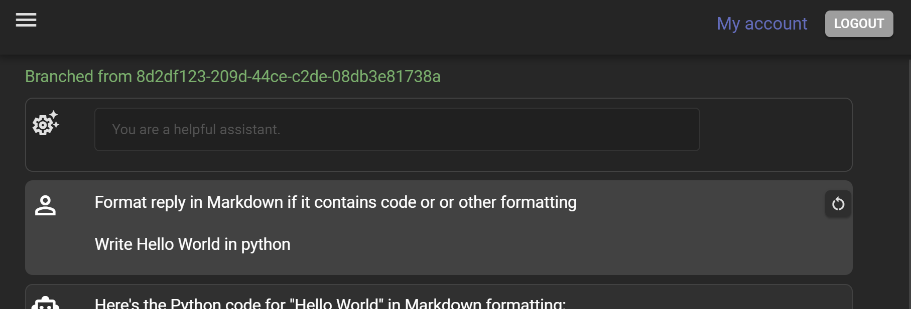

Update: BlazorGPT now uses the <a href="https://learn.microsoft.com/en-us/semantic-kernel/overview">Semantic Kernel</a>
project. It replaces the Betalgo OpenAI package and adds support for the Semantic Kernel API with concepts such as planners and support for Microsoft Copilot and OpenAI plugins.

### Why is this?

When you are using ChatGPT, you might find yourself having to repeatedly prepare your questions with different sets of contexts. Over and over again.
- If you are working with a specific technology, you might want to add a context such as "I am a C# developer using Azure Durable Functions in Isolated Mode".
- When asking for travel advice, you might want to add location and scheduling context.
- If you want articles in a preferred structure and formatted output, you might have to give very specific instructions, and if you do many of these, it can be tedious.

- Or you might find yourself repeatedly asking the same follow-up questions to get the information you need.
- You want the output in a specific format, such as CSV or Markdown.

It is also very fin to build web apps.
# BlazorGPT (what is it?)

That's where BlazorGPT comes in. It is a Blazor Server application that uses the ChatGPT 3.5 or ChatGPT-4 API. It allows you to create and manage multiple chat sessions with history. You can create QuickProfiles for quick access to your favorite text snippet shortcuts. You can create Scripts with mutiple steps for automating a conversation. You can branch conversations into side conversations with the same context. You can restart a conversation from a previous step. And you can customize the chat experience with middlewares and filters.

As a developer it's extensible and you can write your own plugins in the form of IInterceptors that intercepts the chat messages and modify them before they are sent to the API. 

[Installation instructions](docs/setup.md)

## Features
- Chat with GPT-3.5 or GPT-4
  
  
- Create and manage multiple chat sessions with history
  
  
- QuickProfiles for quick access to your favorite text snippet shortcuts
  

- Scripts with mutiple steps for automating a conversation
  
  
- Branching of conversations into side conversations with the same context
  
  

- Restart a conversation from a previous step

[Installation instructions](docs/setup.md)
